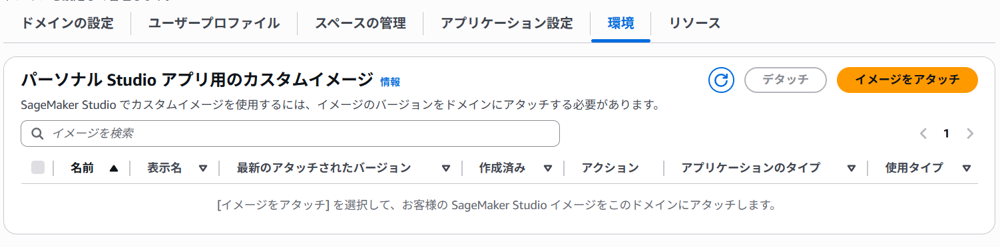
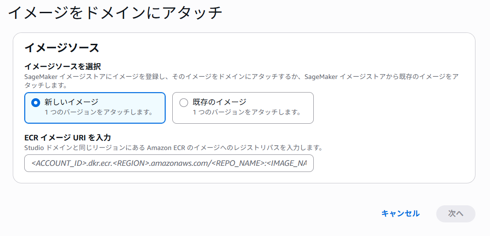
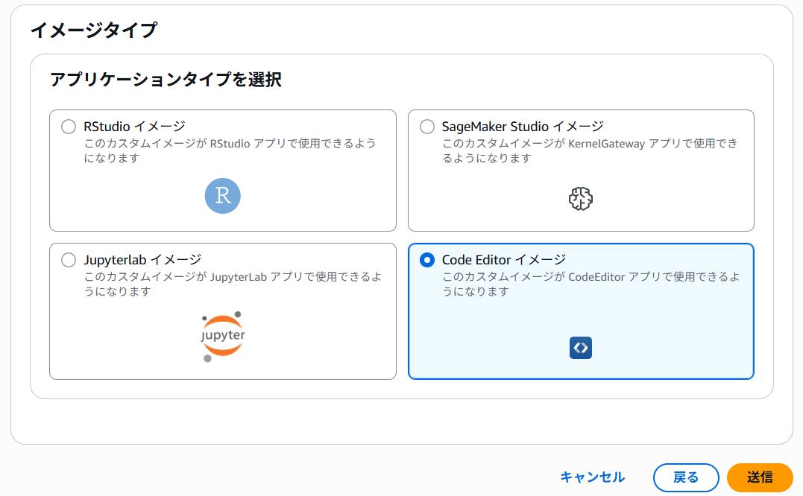

# webdev-container-for-sagemaker
Sagemaker Studio AI CodeEditor上でローカルホストしたWebアプリケーションにアクセスする実験

## 目的
- SageMakerAI CodeEditor上のコンテナのローカルホストにホスティングしたWebアプリケーションへ接続できるか検証する。
- 対象Webアプリケーションを作成するための手順をまとめる。

## 前提知識
### SageMakerStudio AI CodeEditor
- {簡単な説明を記載}

### Nginx
- {簡単な説明を記載}

## 手順
1. 作業用のSageMaker Studio CodeEditorを準備。ソースをclone
```bash
git clone <your-repo>
cd webdev-container-for-sagemaker
```
2. dockerのビルド
```bash
# 使用するSageMaker Distributionのバージョンを指定
# 選択可能な一覧：https://docs.aws.amazon.com/en_us/sagemaker/latest/dg/sagemaker-distribution.html
export BASE_TAG=3.1-cpu
export REPO_NAME=<your-repo-name>
# imgファイルの作成：YYYYMMDDは現在の日時を指定すること
docker build --network sagemaker \
  --build-arg BASE_TAG \
  -t ${REPO_NAME:-img}:${BASE_TAG:-latest}-YYYYMMDD .
```
```bash
# 試行錯誤してビルドイメージが多数できている場合は以下のコマンドから削除
# ローカルのDocker imageを確認
docker images
docker image prune -a
```

3. AWS ECRへpush  
参考：[Pushing a Docker image to an Amazon ECR private repository - AWS ECR Iser Guide](https://docs.aws.amazon.com/AmazonECR/latest/userguide/docker-push-ecr-image.html)
```bash
# 必要に応じて権限のあるIAMを作成・利用
aws configure --profile <your-profile-name>
export AWS_PROFILE=<your-profile-name>
# Login
aws ecr get-login-password --region ap-northeast-1 | docker login --username AWS --password-stdin 1234567890.dkr.ecr.ap-northeast-1.amazonaws.com

# Tag付け
docker tag ${REPO_NAME:-img}:${BASE_TAG:-latest}-YYYYMMDD 1234567890.dkr.ecr.ap-northeast-1.amazonaws.com/${REPO_NAME:-img}:${BASE_TAG:-latest}-YYYYMMDD

# push
docker push 1234567890.dkr.ecr.ap-northeast-1.amazonaws.com/${REPO_NAME:-img}:${BASE_TAG:-latest}-YYYYMMDD
```
4. SageMakerStudio CodeEditorにてCustomイメージを指定
- AWSコンソール上のSageMaker>ドメイン＞ドメインの詳細＞環境よりイメージをアタッチ

- ecrのURIを記入：`1234567890.dkr.ecr.ap-northeast-1.amazonaws.com/${REPO_NAME:-img}:${BASE_TAG:-latest}-YYYYMMDD`

- CodeEditorを選択


## 調査メモ
### AWS提供のSageMakerDistribution ImageでPort Forwardingできるか
- SageMaker上にて、FASTAPIのローカルサーバを立てたがアクセスできなかった。
- `uv run uvicorn src.main:app --reload --host 0.0.0.0 --port 8000`：FASTAPI起動
- `INFO:     Uvicorn running on http://0.0.0.0:8000 (Press CTRL+C to quit)`のログを確認
- `https://<studio-id>.studio.aws.<region>.amazonaws.com/codeeditor/default/proxy/8000/`へアクセス
- Webページにて`Not Found`のみが表示される

### SageMakar上でdocker imageをビルドする場合
- `docker build -t code-editor-custom-image .`のように、`--network`を指定しない場合エラーとなる。
- エラーメッセージ
```bash
$ docker build -t code-editor-custom-image .
DEPRECATED: The legacy builder is deprecated and will be removed in a future release.
            BuildKit is currently disabled; enable it by removing the DOCKER_BUILDKIT=0
            environment-variable.

Sending build context to Docker daemon  66.56kB
Error response from daemon: {"message":"Forbidden. Reason: [ImageBuild] 'sagemaker' is the only user allowed network input"}
```
- `docker build --network sagemaker -t code-editor-custom-image .`のように、`--network sagemaker`を指定することで回避できる
- SageMaker上でdockerを利用する場合、いくつかの制約事項があるため[公式Doc](https://docs.aws.amazon.com/sagemaker/latest/dg/docker-containers.html)を確認すること

## 参考
- [Amazon ECR User Guide](https://docs.aws.amazon.com/AmazonECR/latest/userguide/what-is-ecr.html)
- [Custom images - Amazon SageMaker AI Developer Guide](https://docs.aws.amazon.com/sagemaker/latest/dg/code-editor-custom-images.html)
- [SageMaker StudioのCode Editorを魔改造してWebアプリのプロキシ機能を追加する - Qiita](https://qiita.com/moritalous/items/859c9977dd6b923472f1)